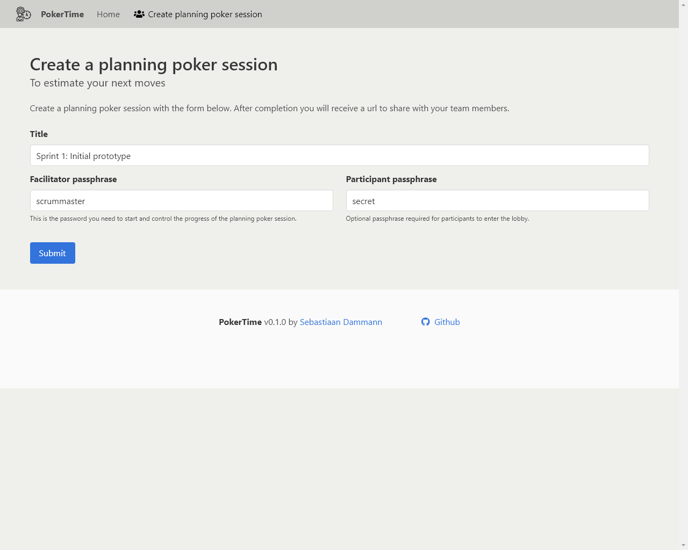
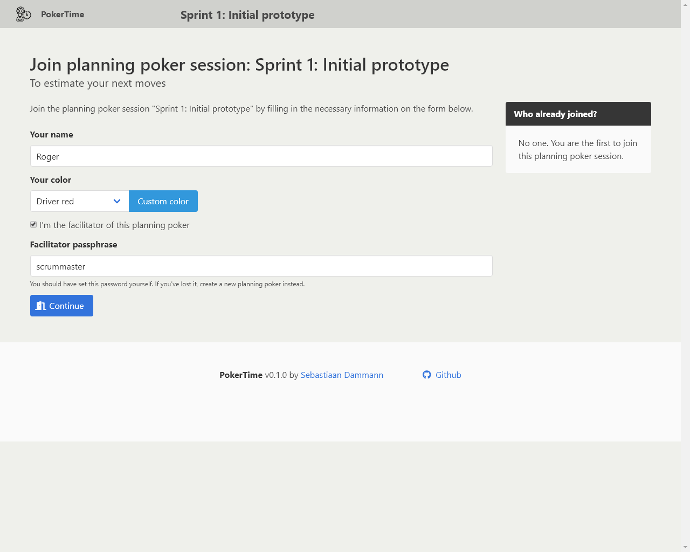
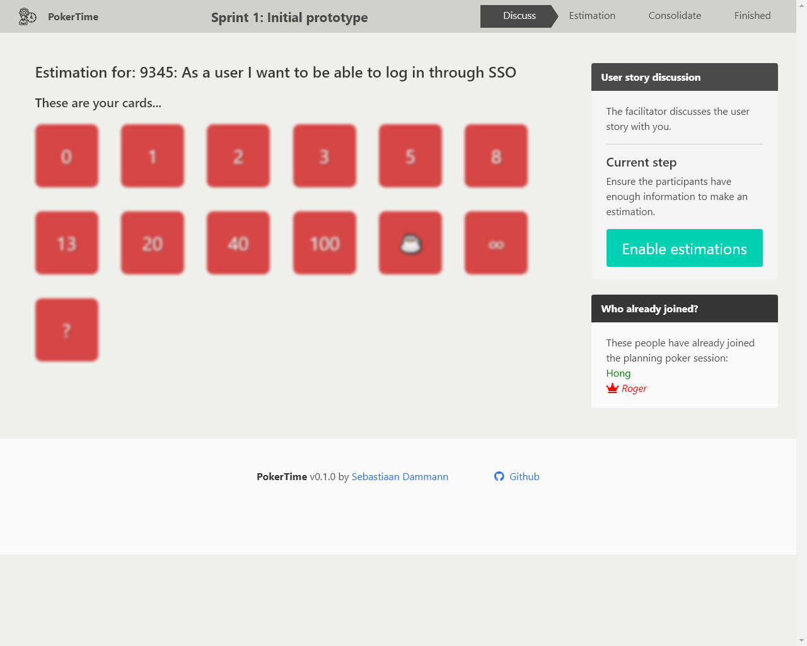
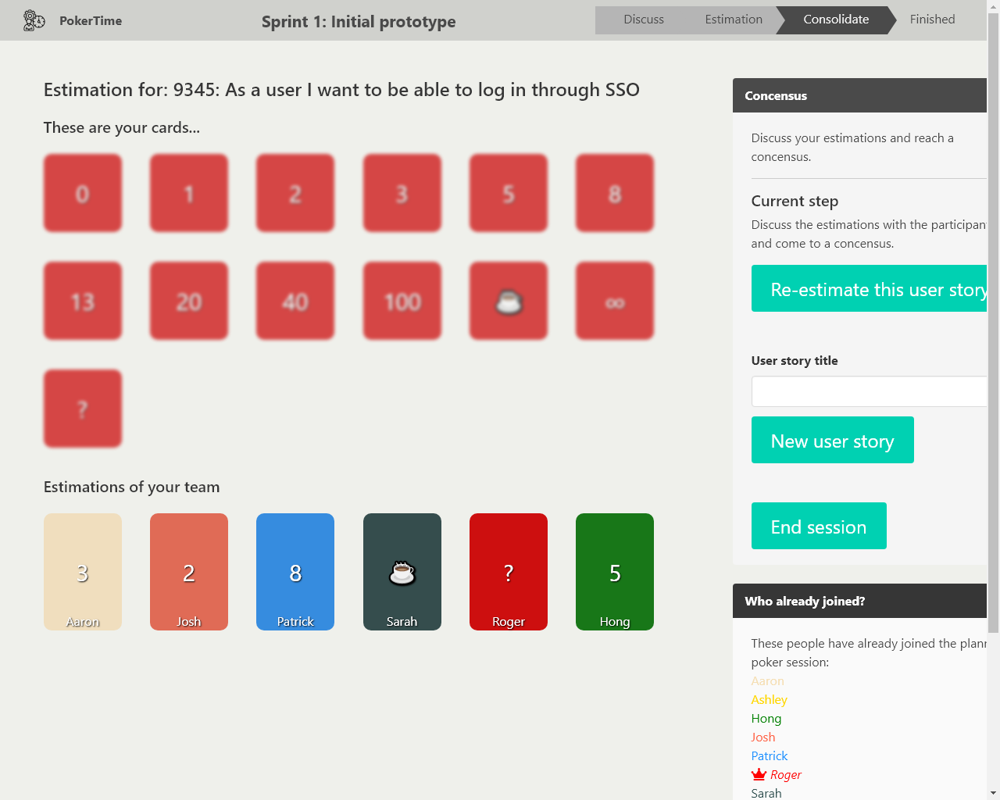
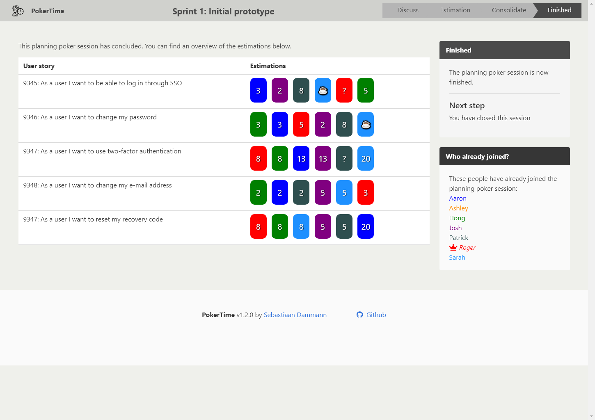

#  PokerTime

Remote planning poker tool built in ASP.NET Core and Blazor

Licensed: GNU GPL v3.0

|                    | master                                                                                                                                                                                                                  | develop                                                                                                                                                                                                                   |
| ------------------ | ----------------------------------------------------------------------------------------------------------------------------------------------------------------------------------------------------------------------- | ------------------------------------------------------------------------------------------------------------------------------------------------------------------------------------------------------------------------- |
| **AppVeyor CI**    |                                                  |                                                  |
| **CircleCI**       |                                                                             |                                                                             |
| **Github actions** |              |              |
| **Codeconv**       |                                                                                             |                                                                                              |
| **Daily build**    |  |  |

## Features

-   Realtime planning poker app, ideal for remote teams
-   Create password protected planning poker sessions
-   As facilitator, lead the planning poker session through the discussion, estimation and consolidation stages
-   Easy to use

### Browser Support

Developed and tested on:

-   Internet Explorer 11
-   Microsoft Edge
-   Google Chrome
-   Mozilla Firefox

## Download

### Docker

PokerTime is available as a docker image. Simply pull it from the Docker hub, and run it:

    docker pull sebazzz/pokertime:latest
    docker run -p 80:80 sebazzz/pokertime

For further configuration you may want to mount a directory with [the configuration](doc/Installation.md#Configuration):

    docker run -p 80:80 -v /path/to/my/configuration/directory:/etc/pokertime sebazzz/pokertime

### Manual installation

Download the release for your OS from the [releases tab](https://github.com/Sebazzz/PokerTime/releases) or download the cutting edge builds from [AppVeyor](https://ci.appveyor.com/project/Sebazzz/PokerTime).

[Follow the installation instructions](doc/Installation.md) in the documentation to install it.

## Building PokerTime from sources

If you prefer to build the application yourself, please follow the [compilation instructions](doc/Building-from-sources.md) in the documentation.

## Screenshots

**Create a planning poker session**

**Join a planning poker session**

**Discussion stage**

**Estimation**

**Coming to a consensus**

**Session conclusion**

## Contributions

Contributions are allowed and encouraged. In general the rules are: same code style (simply use the included `.editorconfig`), and write automated tests for the changes.

Please submit an issue to communicate in advance to prevent disappointments.

## Attribution

Application icon:

-   Icon made by [Eucalyp](https://www.flaticon.com/authors/eucalyp) from [www.flaticon.com](http://www.flaticon.com/)

Built on:

-   [Bulma](https://bulma.io) _CSS framework_;
-   [Fontawesome](http://fontawesome.io/) as _icon framework_;
-   [ASP.NET Core 3.1](https://dot.net) (Blazor Server) with [Entity Framework Core](https://docs.microsoft.com/en-us/ef/core/) for _server side logic and data persistence_;
